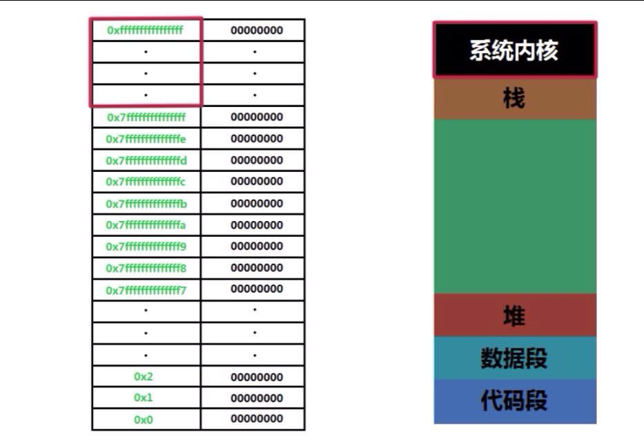

####Pointer.c
#####Sum
```
Global:  &global
= (int *) 0x100001018 <global>
Static:  &count
= (int *) 0x100001020 <square.count>
= (int *) 0x10000101c <rect.count>
Function: &square
= (int (*)(int)) 0x100000ea0 <square>
```

#####Memory


#####Details(gdb)
```
(gdb) start
...
Temporary breakpoint 1, main () at pointer.c:25
25		int a = 2;
(gdb) n
26		int b = 6;
(gdb) 
27		int *pa = &a;
(gdb) 
28		int *pb = &b;
(gdb) 
29		int *pglobal = &global;
(gdb) 
30		int (*psquare)(int a) = &square;
(gdb) p &a
$1 = (int *) 0x7fff5fbffa38
(gdb) p &b
$2 = (int *) 0x7fff5fbffa34
(gdb) p &pa
$3 = (int **) 0x7fff5fbffa28
(gdb) p &pb
$4 = (int **) 0x7fff5fbffa20
(gdb) p &global
$5 = (int *) 0x100001018 <global>
(gdb) p &pglobal
$6 = (int **) 0x7fff5fbffa18
(gdb) p &square
$7 = (int (*)(int)) 0x100000ea0 <square>
(gdb) p &psquare
$8 = (int (**)(int)) 0x7fff5fbffa10
(gdb) n
31		int s1 = square(a);
(gdb) s
square (a=2) at pointer.c:17
17		count++;
(gdb) bt
#0  square (a=2) at pointer.c:17
#1  0x0000000100000f3b in main () at pointer.c:31
(gdb) n
18		global++;
(gdb) p &count
$9 = (int *) 0x100001020 <square.count>
(gdb) n
19		int s = rect(a, a);
(gdb) p &global
$10 = (int *) 0x100001018 <global>
(gdb) s
rect (a=2, b=2) at pointer.c:8
8		count++;
(gdb) bt
#0  rect (a=2, b=2) at pointer.c:8
#1  0x0000000100000eda in square (a=2) at pointer.c:19
#2  0x0000000100000f3b in main () at pointer.c:31
(gdb) n
9		global++;
(gdb) p &count
$11 = (int *) 0x10000101c <rect.count>
(gdb) n
10		int s = a * b;
(gdb) p &global
$12 = (int *) 0x100001018 <global>
(gdb) n
11		return s;
(gdb) 
square (a=2) at pointer.c:20
20		return s;
(gdb) 
main () at pointer.c:32
32		int s2 = rect(a, b);
(gdb) s
rect (a=2, b=6) at pointer.c:8
8		count++;
(gdb) bt
#0  rect (a=2, b=6) at pointer.c:8
#1  0x0000000100000f49 in main () at pointer.c:32
(gdb) n
9		global++;
(gdb) p &count
$13 = (int *) 0x10000101c <rect.count>
(gdb) n
10		int s = a * b;
(gdb) 
11		return s;
(gdb) 
main () at pointer.c:33
33		printf("s1=%d\ns2=%d\n", s1, s2);
(gdb) 
s1=4
s2=12
34		return 0;
```

####Somethings ??
#####array_pointer.c
```
*p=8        //Why *p = &b, ( why "*p = &a" cann't work?)
*p=3
*p=0
*p=1
*p=10
*p=100
--------------
p[0]=8
p[1]=3
p[2]=0
p[3]=1
p[4]=10
p[5]=100
```
