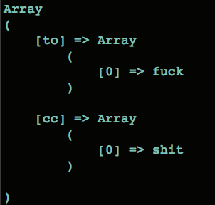

start

```
./mongo
Failed global initialization: BadValue Invalid or no user locale set. Please ensure LANG and/or LC_* environment variables are set correctly.
```
export LC_ALL=C

> ####[mongodb-manual](https://docs.mongodb.org/manual/)

> ####[php-mongo](http://php.net/mongo)

It's verrrrrrrrrrrrry ''awesome''!

PS: my examples, I copyed them from [here](http://www.phpro.org/tutorials/Introduction-To-MongoDB-And-PHP-Tutorial.html#5)

Easy to try




